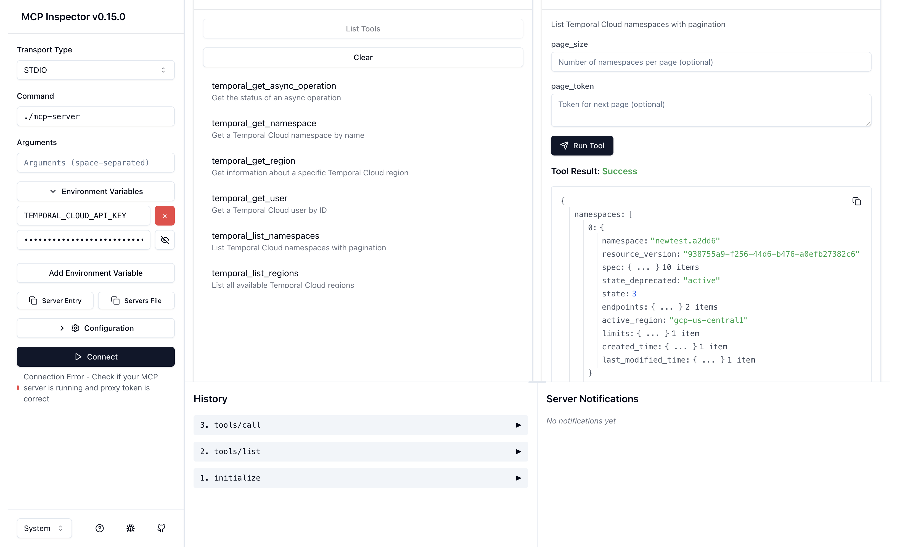

# temcp: Temporal Cloud MCP Server

An MCP (Model Context Protocol) server that exposes Temporal Cloud operations as tools for AI assistants.

## Testing with MCP Inspector



For interactive testing and debugging, you can use the MCP Inspector:

### Prerequisites
1. Build the MCP server:
   ```bash
   go build -o mcp-server ./cmd/mcp-server
   ```

2. Export your API key:
   ```bash
   export TEMPORAL_CLOUD_API_KEY="your-temporal-cloud-api-key"
   ```

### Launch Inspector
```bash
npx @modelcontextprotocol/inspector ./mcp-server
```

### Connect in Browser
1. Open the URL provided by the inspector (e.g., `http://localhost:6274`)
2. In the Inspector UI, re-enter your API key in the environment variables section
3. Click "Connect"
4. Navigate to the "Tools" tab to test all tools interactively

## Usage with Cursor

Configure `.cursor/mcp.json`:
```json
{
  "mcpServers": {
    "temporal-cloud": {
      "command": "/path/to/mcp-server",
      "args": [],
      "env": {
        "TEMPORAL_CLOUD_API_KEY": "your-api-key"
      }
    }
  }
}
```

## Building the MCP Server

```bash
go build -o mcp-server ./cmd/mcp-server
```

## Available Commands

The MCP server provides 13 tools for managing Temporal Cloud resources:

**User Management:**
- `temporal_get_user` - Get user details by ID
- `temporal_list_users` - List users with pagination

**Namespace Management:**
- `temporal_get_namespace` - Get namespace details by name
- `temporal_list_namespaces` - List namespaces with pagination
- `temporal_create_namespace` - Create a new namespace
- `temporal_update_namespace` - Update an existing namespace
- `temporal_delete_namespace` - Delete a namespace

**Region Management:**
- `temporal_get_region` - Get region details by ID
- `temporal_list_regions` - List all available regions

**Async Operations:**
- `temporal_get_async_operation` - Get async operation status
- `temporal_wait_for_operation` - Wait for async operation completion

**Export Processing:**
- `temporal_process_export` - Process exported workflow history files
- `temporal_analyze_export` - Analyze exported workflows and extract summaries
