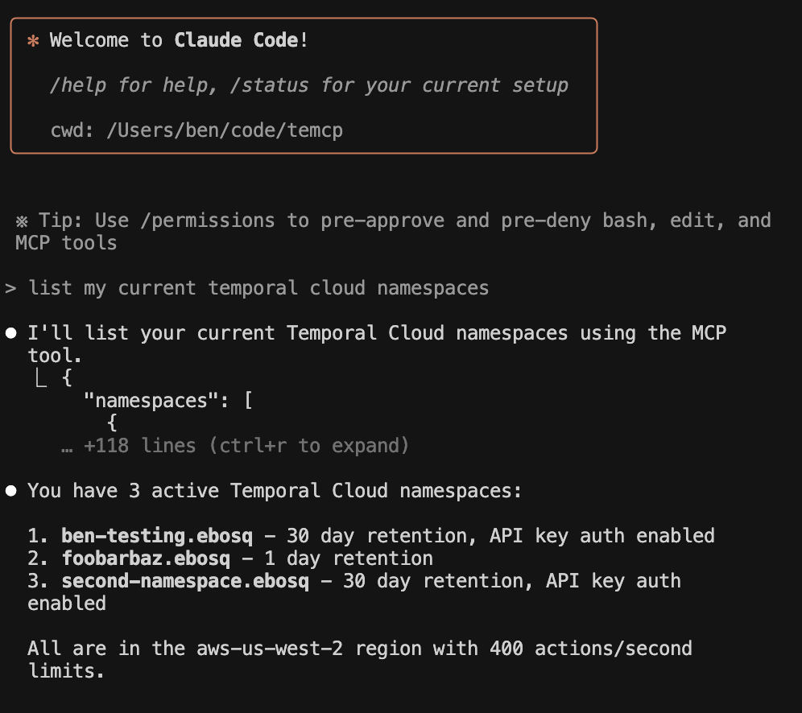

# temcp: Temporal Cloud MCP Server

An MCP (Model Context Protocol) server that exposes Temporal Cloud operations as tools for AI assistants.

Stuff you can do:

  - What namespaces do I have access to?
  - What does Jane Doe have access to?
  - Create namespace-foo in aws us west with 1 day retention
  - Give service-account-1 access to namespace-foo
  - Add an API key for service-account-1

## Try with MCP Inspector


1. Export your API key:
   ```bash
   export TEMPORAL_CLOUD_API_KEY="your-temporal-cloud-api-key"
   ```

2. Launch Inspector
    ```bash
    npx @modelcontextprotocol/inspector ./mcp-server
    ```

3. Open the URL provided by the inspector (e.g., `http://localhost:6274/?MCP_PROXY_AUTH_TOKEN=tokenhash`)
4. Click "Connect"
5. Navigate to the "Tools" tab to test all tools interactively

## Use with Claude Code



```bash
claude mcp add temporal-cloud /path/to/mcp-server -e TEMPORAL_CLOUD_API_KEY="your-api-key"    
```

## Use with Cursor

Configure `.cursor/mcp.json`:
```json
{
  "mcpServers": {
    "temporal-cloud": {
      "command": "/path/to/mcp-server",
      "args": [],
      "env": {
        "TEMPORAL_CLOUD_API_KEY": "your-api-key"
      }
    }
  }
}
```

## Building the MCP Server

```bash
go build -o mcp-server ./cmd/mcp-server
```

## Available Tools

**User Info:**
- `temporal_get_user` - Get user details by ID
- `temporal_list_users` - List users

**Account Access Info:**
- `temporal_get_account_access` - Get a user's account-level access role (owner, admin, developer, finance_admin, read)

**API Key Creation:**
- `temporal_create_api_key` - Create a new API key for a user or service account

**Namespace Access Management:**
- `temporal_get_user_namespace_access` - Get a user's access level for a specific namespace
- `temporal_set_user_namespace_access` - Set or update a user's access level for a specific namespace

**Namespace Management:**
- `temporal_get_namespace` - Get namespace details by name
- `temporal_list_namespaces` - List namespaces
- `temporal_create_namespace` - Create a new namespace (defaults to API key auth enabled)
- `temporal_update_namespace` - Update an existing namespace
- `temporal_delete_namespace` - Delete a namespace

**Region Availability:**
- `temporal_get_region` - Get region details by ID
- `temporal_list_regions` - List all available regions

**Async Operations:**
- `temporal_get_async_operation` - Get async operation status
- `temporal_wait_for_operation` - Wait for async operation completion

**Service Account Management:**
- `temporal_list_service_accounts` - List Temporal Cloud service accounts
- `temporal_get_service_account_namespace_access` - Get namespace access permissions for a service account
- `temporal_set_service_account_namespace_access` - Set namespace access permissions for a service account

**Cloud Connection Info:**
- `temporal_cloud_connection_info` - How to configure connections to Temporal Cloud

**Export Processing:** (untested as of July 2)
- `temporal_process_export` - Process exported workflow history files
- `temporal_analyze_export` - Analyze exported workflows and extract summaries

Note: per the MCP spec, the read-only tools should be resources. Everything's implemented as a tool because Cursor only supports tools for now.

Based on https://github.com/temporalio/cloud-samples-go

Uses https://github.com/mark3labs/mcp-go
